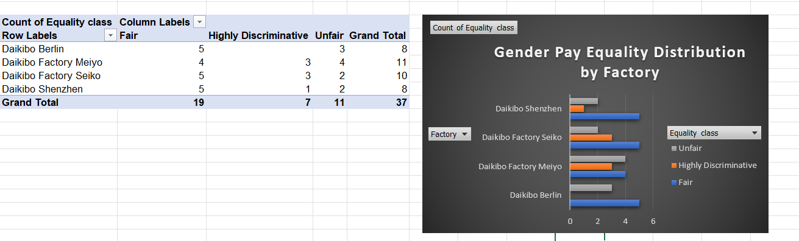

# Gender Pay Equality Analysis

## Project Overview
This project analyzes gender pay equality across different factories and job roles.  
The dataset contains equality scores ranging from -100 to +100, where 0 represents perfect equality.

## Objective
Classify equality scores into meaningful categories to understand the distribution of pay equality across factories.

## Method
Using Excel formulas, the equality scores were classified into three categories:

- Fair (-10 to +10)
- Unfair (-20 to -10 and 10 to 20)
- Highly Discriminative (< -20 or > 20)

## Analysis
A Pivot Table was used to summarize the distribution of equality classes across factories.

## Visualization
A bar chart was created to visualize how equality categories are distributed across factories.

## Tools Used
- Microsoft Excel
- Pivot Tables
- Data Visualization

## Dashboard Preview

